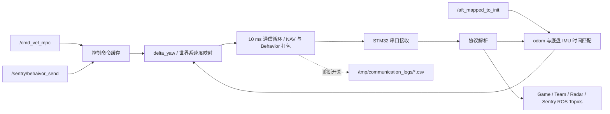

# 🔌 Communication

> 导航计算机与底盘 STM32、裁判系统数据之间的 ROS 2 通信桥：接收 MPC/行为指令，完成坐标与协议打包，并把底盘、比赛和雷达信息发布给上层决策。

[返回项目主页](../../../README.md) · [MPC 控制器](../minco_controller/README.md) · [BT Manager](../../decision/bt_manager/README.md)

## ✨ 模块定位

`communication_sentry` 将 ROS 2 导航/决策接口与串口协议隔离。它不生成轨迹，也不决定比赛策略；其职责是保持控制命令、里程计姿态、底盘 IMU、裁判数据和协议字段之间的一致转换。

## 🧠 模块流程图



### 流程概述

MPC 世界系速度和行为树指令分别写入缓存；odom 以最新状态进入独立 callback group，并与串口接收的底盘 IMU yaw 历史按时间窗匹配，得到 `delta_yaw`。10 ms 通信循环把最新控制、姿态和行为字段打包发送到 STM32；串口接收线程解析底盘与裁判数据，再发布为上层 ROS 2 消息。

## 🧪 技术方向

- `/cmd_vel_mpc` 保持世界坐标系速度语义，communication 结合 `delta_yaw` 转换为当前底盘协议需要的方向。
- `delta_yaw` 使用 odom stamp 与有界底盘 IMU yaw 历史做最近时间匹配；未初始化时抑制平移命令，避免用错误航向发送世界系速度。
- 串口由 `FdManager` 与 timer manager 独立线程维护，ROS callback 与通信循环使用不同 callback group。
- 裁判/底盘协议字段通过 `ros_interfaces` 暴露给 BT Manager；协议位段、枚举、打包和 blackboard 需要同步修改。

## ⚡ 性能方向

- odom 使用 `KeepLast(1) + best_effort + volatile`，避免高频定位消息积压；callback 位于专用 mutually-exclusive group。
- 控制命令和行为消息使用深度 1，始终以最近指令为准；裁判状态 publisher 使用深度 10。
- 主通信 timer 为 10 ms；全局路径辅助发送 timer 为 1 s；性能诊断开启后另以 1 s 汇总 TX/RX 分包频率。
- `CsvRecorder` 由 `communication.enable_performance_diagnostics` 控制，默认关闭；关闭时不记录 NAV CSV，也不打印频率摘要。

## 📡 ROS 接口

### 输入

| Topic | 类型 | QoS / 说明 |
|---|---|---|
| `/cmd_vel_mpc` | `geometry_msgs/msg/Twist` | 深度 1，MPC 世界系速度 |
| `/cmd_force_mpc` | `geometry_msgs/msg/WrenchStamped` | 深度 1，力控制兼容入口 |
| `/aft_mapped_to_init` | `nav_msgs/msg/Odometry` | `KeepLast(1) + best_effort + volatile` |
| `/sentry/behaivor_send` | `ros_interfaces/msg/Behavior` | 深度 1，行为/资源/姿态指令 |

### 输出

| Topic | 内容 |
|---|---|
| `/sentry/game_info` | 比赛阶段、剩余时间、资源、人工点与敌方前哨站/基地血量 |
| `/sentry/offline_info` | 底盘离线数据、装甲板、升降、姿态与底盘 IMU |
| `/sentry/online_info` | 血量、弹量、热量和能量等在线信息 |
| `/sentry/team_info` | 友方机器人、基地和前哨站状态 |
| `/sentry/radar_info` | 敌方机器人与雷达信息 |

## ⚙️ 配置

| 参数 | 默认值 | 说明 |
|---|---:|---|
| `communication.enable_performance_diagnostics` | `false` | CSV、TX/RX 频率与匹配诊断总开关 |
| `communication.imu_yaw_window_ms` | `40` ms | odom 与底盘 IMU yaw 的最大匹配时间窗 |
| `global_path.map_frame` | `map` | 全局路径坐标系 |
| `global_path.minimap_frame` | `minimap` | 小地图坐标系 |

串口设备当前由源码静态值 `/dev/ttyACM0` 打开，波特率为 `115200`。这是实车绑定配置，换设备时必须同时检查 udev 稳定命名和权限。

## 📈 CSV 性能诊断

开启：

```bash
ros2 run communication communication \
  --ros-args -p communication.enable_performance_diagnostics:=true
```

CSV 写入：

```text
/tmp/communication_logs/sent_messages_<timestamp>.csv
```

记录字段包括：

- 发送结果、目标速度、当前反馈速度、世界系映射结果和速度控制标志；
- odom stamp、接收时间、消息年龄；
- 底盘 IMU 历史长度/跨度、最近匹配时间差和是否匹配成功；
- `delta_yaw` 候选、初始化状态、最后更新时间和连续匹配失败次数；
- 底盘 self packet 数量/年龄及 offline topic 发布耗时。

当前实现每条记录都会 flush，诊断本身具有磁盘 IO 成本，只应在复现通信/时间匹配问题时短时开启。

## ⚠️ 已知问题与改进方向

- 串口设备路径硬编码，缺少参数化和启动前设备身份校验。
- `delta_yaw` 依赖 Point-LIO 与底盘 IMU 时间基准可比较；时间戳不同源时，窗口匹配结果不能代表同一姿态时刻。
- CSV 每行同步 flush，长时间开启会扰动 10 ms 通信循环；后续可在保持故障可恢复性的前提下改为有界批量 flush。
- 性能诊断主要覆盖 NAV 发送和时间匹配，不等于完整串口链路追踪；网络丢包、内核串口缓冲和下位机解析仍需外部证据。

## 🚀 启动与检查

```bash
ros2 launch communication com.launch.py
ros2 node info /communication_sentry
ros2 topic hz /sentry/offline_info
ros2 topic echo /sentry/game_info --once
```

若平移命令被抑制，先检查日志中的 `delta_yaw is not initialized`、odom 时间戳和底盘 self packet，而不是直接绕过保护。

## 🗂️ 关键源码

- `include/com_interface_ros.hpp`：ROS topic、callback group、timer、时间匹配和坐标转换。
- `include/com.hpp` / `src/com.cpp`：串口生命周期、协议收发和包频率统计。
- `include/csv_recorder.hpp` / `src/csv_recorder.cpp`：可选 NAV CSV。
- `include/utils/protocol.hpp`：协议结构。
- `launch/com.launch.py`：节点启动与诊断总开关。
